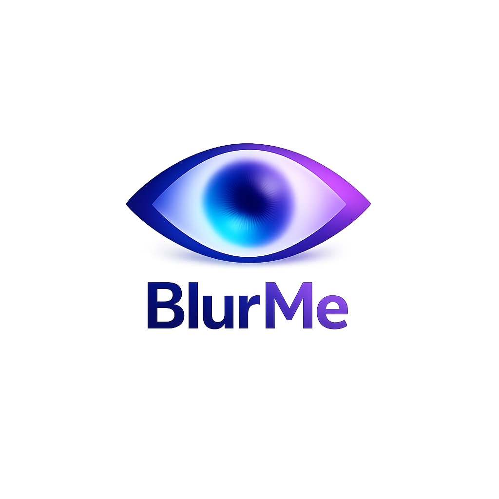
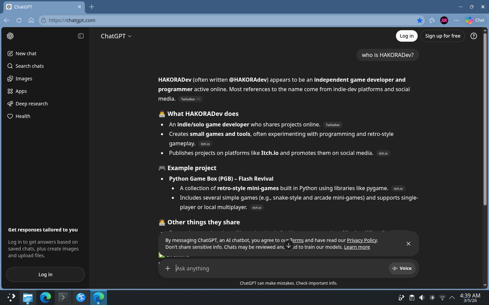
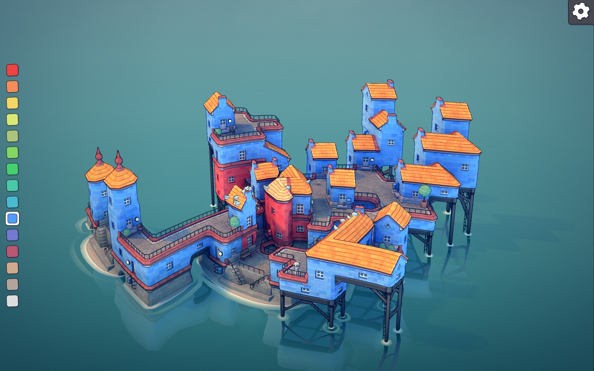

# BlurMe - Screen Privacy Blur Overlay

<p align="center">
  
</p>

**BlurMe** is a lightweight, real-time screen blurring tool that protects your privacy during presentations, streaming, or screen sharing. With customizable blur intensity, grayscale conversion, and opacity control, BlurMe creates a soft-focus overlay over your entire screen — activated instantly with global hotkeys.

[](https://github.com/YOUR_USERNAME/BlurMe/releases)
[](https://opensource.org/licenses/MIT)


📦 **Latest Release: v1.0.0** — Pre-built binaries available for Windows, macOS, and Linux.

**Important Notes:**
- 🔧 **Run from source for the latest features.** Pre-built binaries are available for each OS under [Releases](https://github.com/YOUR_USERNAME/BlurMe/releases), but running from source ensures you have the newest updates.
- 🤖 **For AI agents and automated tools:** See [Bots.md](Bots.md) (if applicable).

📋 **For detailed version history, see [CHANGELOG.md](changelog.md)**

---

## Quick Start

### Option 1: Download Binary (Recommended for End Users)
Grab the latest release for your operating system from the [Releases page](https://github.com/YOUR_USERNAME/BlurMe/releases):
- **Windows:** `BlurMe_Windows_x64.exe`
- **macOS:** `BlurMe_macOS.dmg`
- **Linux:** `BlurMe_Linux_x86_64.AppImage`

Run the executable — no installation required.

### Option 2: Run from Source (For Developers / Power Users)
```bash
# Clone the repository
git clone https://github.com/YOUR_USERNAME/BlurMe.git
cd BlurMe

# Install dependencies
pip install -r requirements.txt

# Launch BlurMe
python src/blurme.py
```

### Installation Requirements (Source)
```bash
# Required
pip install PyQt5 mss pynput

# Optional (for performance)
pip install opencv-python numpy Pillow
```

---

## Features

- **Real-time Screen Blur** — Applies a Gaussian blur to your entire screen with adjustable radius.
- **Grayscale Mode** — Convert the blurred image to grayscale with configurable intensity.
- **Opacity Control** — Fine-tune the overlay transparency.
- **Global Hotkeys** — Toggle, adjust settings, and close without ever touching the mouse.
- **Cross-Platform** — Works on Windows, macOS, and Linux (X11).
- **Low CPU Usage** — Optimized capture and processing; uses OpenCV acceleration when available.
- **Persistent Settings** — Your preferences are saved automatically to `blur.conf`.

---

## Controls

BlurMe responds to the following global hotkeys (press simultaneously where noted):

| Key Combination | Action |
|-----------------|--------|
| `F1` | Switch to **colored blur** mode |
| `F2` | Switch to **grayscale blur** mode |
| `F3` | Decrease grayscale intensity |
| `F4` | Increase grayscale intensity |
| `-` (minus) | Decrease overlay opacity |
| `+` (plus) | Increase overlay opacity |
| `/` (slash) | Decrease blur radius |
| `*` (asterisk) | Increase blur radius |
| `Ctrl` + `Alt` + `B` | Toggle BlurMe on/off |
| `Ctrl` + `Alt` + `C` | Close BlurMe completely |

*On some keyboards, `+` and `*` may require the Shift key or be located on the numeric keypad.*

---

## Showcase

BlurMe transforms your screen in real-time. Here are some examples:

| Original | Colored Blur | Grayscale Blur |
|----------|--------------|----------------|
|  |  | – |
|  |  |  |

*Left: original screen content. Middle/Right: with BlurMe overlay active.*

---

## Installation Details

### Prerequisites (for source)
- Python 3.6 or higher
- pip package manager
- Linux users: X11 session required (Wayland not supported)

### Dependencies
| Package | Purpose | Required |
|---------|---------|----------|
| `PyQt5` | GUI framework and overlay window | ✅ Yes |
| `mss`   | Fast screen capture | ✅ Yes |
| `pynput`| Global hotkey listener | ✅ Yes |
| `opencv-python` | Accelerated image processing | ❌ Optional |
| `numpy` | Array operations (used with OpenCV) | ❌ Optional |
| `Pillow` | Fallback image processing | ❌ Optional |

If OpenCV and numpy are installed, BlurMe uses them for faster blurring and grayscale conversion. Otherwise, it falls back to Pillow.

### Building a Binary
To create a standalone executable for your platform:
```bash
pip install pyinstaller
pyinstaller --onefile --windowed --icon=src/blurme.ico src/blurme.py
```

---

## Technical Highlights

- **Multi-Backend Processing:** Automatically selects the fastest available image processing library (OpenCV → Pillow).
- **Efficient Screen Capture:** Uses `mss` (Multi-Screen Screenshot) for low-latency, high-performance screen grabbing.
- **Global Hotkeys:** Reliable key detection via `pynput`, with special handling for numpad keys and modifiers.
- **Persistent Configuration:** Settings stored in plain-text `blur.conf` next to the executable or script.
- **Overlay Window:** A frameless, click-through, always-on-top window that paints the processed screen image with adjustable opacity.
- **X11 Specifics:** On Linux, uses `xprop` to enforce fullscreen and docking window properties for reliable overlay behavior.
- **Windows DPI Awareness:** Applies display affinity to ensure the overlay stays on top even in high‑DPI scenarios.

### Performance
| Setting | CPU Usage (approx) |
|---------|-------------------|
| No blur (radius 0) | < 1% |
| Light blur (radius 10) | 2–5% |
| Heavy blur (radius 50) | 5–10% |

*Measured on a modern 4‑core CPU at 30 FPS. Enabling OpenCV can reduce load by up to 50%.*

---

## Documentation

- **[CHANGELOG.md](changelog.md)** — Version history and release notes.
- **[Bots.md](Bots.md)** — Guidelines for AI agents and automated systems (if applicable).

---

## Contributing

BlurMe is open-source (MIT License) and welcomes contributions:

- New features (e.g., region selection, multiple monitors)
- Performance improvements
- Bug fixes and platform compatibility enhancements
- Documentation and translations

Please submit pull requests or issues via GitHub.

---

## License

MIT License — See [LICENSE](LICENSE) for full details.

---

## Acknowledgments

Built with appreciation for the open-source Python community and the developers of `mss`, `pynput`, and PyQt5. Inspired by the need for simple, effective screen privacy tools.

**Resources:** [GitHub Releases](https://github.com/YOUR_USERNAME/BlurMe/releases) | [Issue Tracker](https://github.com/YOUR_USERNAME/BlurMe/issues)
